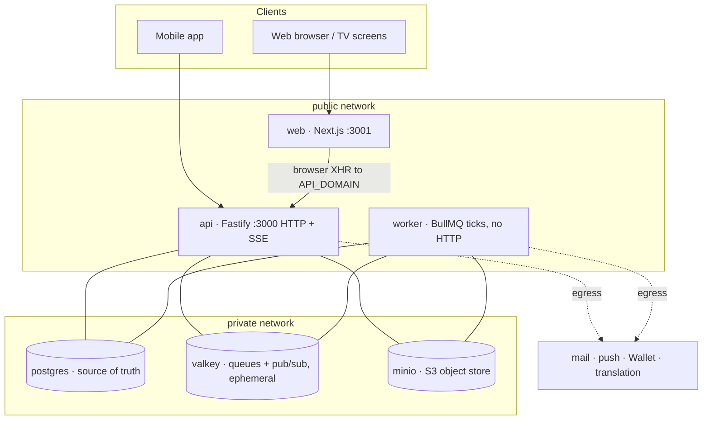

# Architecture & infrastructure

This is the system view of hackOS: the services, their boundaries and the
deployment assumptions that matter when the event grows. The operational
runbook is [`deploy/README.md`](../deploy/README.md); the environment inventory
is [`env-vars.md`](./env-vars.md).

> **One image, one tenant.** The backend is one Docker image run as API,
> worker or migration process. A deployed Compose project serves one
> hackathon and owns its database, cache, object storage, volumes and secrets.

## 1. Runtime topology



The single-stack Compose file creates both networks. The API and worker join
both because they need datastores and outbound provider access. Web joins only
the public network. Postgres, Valkey and MinIO have no published ports. API
and web publish host ports so a host firewall or external load balancer can
provide DNS and TLS without requiring a deployment-specific network.

The split service files use `INSTANCE_NETWORK` for the shared private Docker
network. Their public ports are still ordinary Compose `ports` mappings.

## 2. Service ownership

### API

Fastify owns HTTP routes, Better Auth, capability checks, raw SQL reads and
writes, SSE subscriptions and durable notification creation. It runs
`node dist/migrate.js && node dist/server.js`; the migration step is
advisory-locked and repeated before listening so a reused container cannot
serve an older schema.

`/healthz` reports process liveness and `/readyz` reports required PostgreSQL
readiness. Valkey is intentionally ephemeral: an outage degrades cache,
queues, rate limiting and realtime behavior without changing PostgreSQL's
durable source of truth.

### Worker

The worker runs `node dist/worker.js` from the same image. It owns the
notification outbox dispatcher, queue pump, confirmation expiry, scheduled
publishing and asynchronous Wallet work. It has no inbound HTTP listener and
uses `SELECT ... FOR UPDATE SKIP LOCKED` plus idempotency rules so replicas can
share work safely.

### Web

The Next.js standalone server serves the browser UI and venue screens. It
reads `API_DOMAIN` at runtime through `/runtime-config.js`, which keeps the
image reusable between environments. It never connects directly to
PostgreSQL, Valkey or MinIO.

### Datastores

- Postgres is the source of truth for identities, event configuration,
  applications, projects, judging, logistics, notifications and audit data.
- Valkey carries BullMQ state, short-lived cache entries, SSE fan-out and
  sequence counters. It may be recreated without losing durable domain data.
- MinIO stores application files and sponsor logos. Private application files
  are served through API authorization and presigned downloads; only the
  configured public sponsor-logo prefix is browser-readable.

## 3. State and event boundaries

The API writes durable changes and their audit rows in the same transaction.
Critical state transitions use row locks and idempotency keys. Realtime events
are emitted after the durable write through Valkey, with shared names from
`packages/shared/src/events.ts`.

The outbox is the boundary for email, push and other notification delivery:
the request records intent and the worker claims/delivers each row. Email
transport is a deployment setting (`MAIL_PROVIDER` and the SMTP variables),
while the email layout branding is code-owned and fixed to the hackOS defaults.

## 4. Network and security boundaries

The private network contains application-to-datastore traffic. The public
network contains only the API, worker egress and web. Datastores have no host
ports. `TRUST_PROXY` is false for direct Compose exposure and must be enabled
only when a trusted external proxy has been configured; this controls whether
forwarded client headers can affect audit IPs and rate-limit identity.

Containers run as unprivileged users with `no-new-privileges`, and the API and
worker use separate pool budgets. Production secrets stay in an untracked
environment file or host secret store and are never baked into images.

TLS certificates, DNS, firewall rules and load balancing are intentionally
host concerns. The application only needs `API_DOMAIN`, `WEB_DOMAIN`,
`CORS_ORIGINS` and the published ports to agree.

## 5. Scalability

API replicas are stateless. SSE fan-out through Valkey means a client on one
replica receives events published by another. The host's load balancer must
route both normal HTTP and long-lived SSE connections to the API port.

Worker replicas split outbox and scheduled work through row locks. Adding
replicas increases PostgreSQL pool demand, so calculate:

```text
(api replicas × DB_POOL_MAX) + (worker replicas × DB_POOL_MAX)
  + migrations + operations < PostgreSQL max_connections
```

For approximately 600 concurrent users, one API and one worker are the sane
starting point. Increase `API_MEM_LIMIT` or `WORKER_MEM_LIMIT` only after
observing CPU, memory, outbox depth and database lock waits. See
[`big-event-readiness.md`](./big-event-readiness.md) for the event-day
checklist.

## 6. Deployment profiles

### Single stack

Use `deploy/docker-compose.yml` for one host. Compose scopes its private and
public networks and volumes by project name. The API and web ports are the
only published application ports.

### Split services

Use `deploy/services/*/docker-compose.yml` when independent service lifecycles
are useful. Create one external private Docker network and set
`INSTANCE_NETWORK` consistently in the Postgres, Valkey, MinIO, API and worker
projects. Keep the same image tag, credentials and domain values across those
projects.

### Disposable qualification

`deploy/qualification/` is a separate, destructive-safe stack for event-day
load testing. It has its own fixed project, database name, volumes and test
accounts; it must never reuse a production `.env` or network.

## 7. Backups and failure recovery

Back up the Postgres and MinIO volumes before migrations and releases. Valkey
can be recreated. If a worker crashes, Compose restarts it and unprocessed
outbox rows remain durable. If the API is unavailable, clients retry through
the host's external routing layer while the database remains intact.

Do not delete the Postgres volume during an API, worker or web redeploy. Apply
schema changes only through the immutable migration chain in
`apps/api/db/migrations/`.
