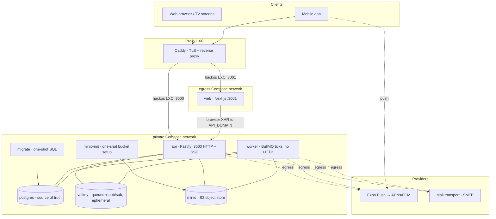
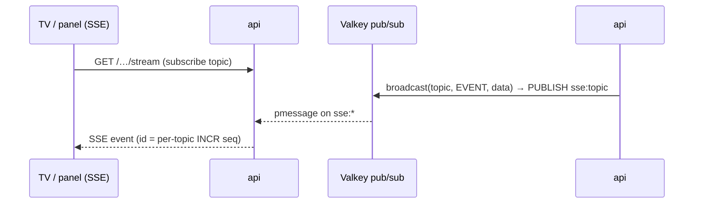

# Architecture & infrastructure

How hackOS is put together as a running system: the services, the stacks they're
built on, how they connect, why the boundaries are drawn where they are, and how
it scales. This is the *system* view; for the operational runbook (Compose,
secrets and deploy order) see [`deploy/README.md`](../deploy/README.md), and
for per-container env vars see [`env-vars.md`](./env-vars.md).

> **One image, one tenant.** The whole backend is a single Docker image
> (`apps/api/Dockerfile`) run in three modes, and one deployed instance serves
> exactly one hackathon. Everything below is per-instance and fully isolated.

---

## 1. The big picture

hackOS is a monorepo (pnpm workspaces) that replaces four legacy hackathon tools
with one platform:

| Path | What | Stack |
|---|---|---|
| `apps/api` | HTTP API + background workers | Fastify 5, BullMQ, `pg` (raw SQL), Better Auth |
| `apps/web` | Operator/participant web app + venue TV screens | Next.js 16 (standalone output) |
| `apps/mobile` | Participant & operator phone app | Expo Router (EAS builds, native APNs/FCM) |
| `packages/shared` | Cross-cutting `capabilities.ts` + `events.ts` | TypeScript, consumed by all |

At runtime that becomes one multi-architecture Compose project with seven
application/runtime services plus the idempotent `minio-init` helper. The same
pre-built SHA image is used by ARM64 staging and Linux/x86_64 production inside
an isolated LXC:



The Compose networks are private to the project. API and web publish only their
HTTP ports to the external proxy; the datastores have no published ports.

---

## 2. Service inventory

`deploy/docker-compose.yml` is the only production source of truth. Compose
pulls pre-built application images from GHCR and pinned infrastructure images
from their official registries, then recreates the application tier after the
explicit `migrate` process succeeds.

### api — the HTTP surface
- **Stack:** Fastify 5, `fastify-type-provider-zod` (schemas *are* the OpenAPI
  docs, served at `/documentation`), Better Auth for identity, `pg` for raw
  parameterized SQL (no ORM), `ioredis` for Valkey.
- **Image/command:** the shared GHCR image, `node dist/server.js`; the server
  entrypoint repeats the migration check as a process-level guard.
- **Network:** the private and egress Compose bridges, with a configurable host
  binding (port `3000`) for the external proxy.
- **Public:** Caddy terminates TLS and proxies the configured API hostname.
  `TRUST_PROXY=true` preserves the real client IP for the audit trail.
- **State:** none. Fully horizontally scalable (§7).
- **Health:** Docker probes `/healthz`; Compose waits for PostgreSQL, Valkey,
  MinIO, migration completion and the API healthcheck before the handoff.
- **Migration:** `migrate` (`node dist/migrate.js`) is a separate one-shot,
  guarded by a Postgres advisory lock.

### worker — background processing
- **Stack:** same image, `node dist/worker.js`. No HTTP listener at all.
- **Network:** the private and egress Compose bridges. It has no host port or
  HTTP ingress, but its NAT egress reaches Expo Push, mail and APNs.
- **What it does:** repeatable BullMQ ticks drain DB-backed tables, while
  event-driven jobs carry explicit payloads for request-started work such as
  account-removal cleanup, meal scans, wallet sync and queue invalidations —
  see [`background-workers.md`](./background-workers.md). Domain state remains
  authoritative in Postgres; the event-driven jobs own their own idempotency
  and retry policy, while BullMQ provides the dispatch and repeatable timing.
- **Health:** process liveness is checked with the container's Node process;
  `restart: unless-stopped` handles crashes.
- **Scale:** replicas are safe — the outbox claim uses `FOR UPDATE SKIP LOCKED`,
  so no row is ever processed twice.

### web — frontend + TV screens
- **Stack:** Next.js 16, standalone output, `apps/web/Dockerfile`.
- **Network:** the egress Compose bridge, with a configurable host binding (port
  `3001`) for the external proxy. It receives only public domain variables and
  never receives a secret or datastore credential.
- **Public:** Caddy proxies `${WEB_DOMAIN}` directly to it. The running Next.js
  server serves `/runtime-config.js` from its `API_DOMAIN`/`WEB_DOMAIN`, so the
  same image digest works in different environments.
- **CORS coupling:** `https://${WEB_DOMAIN}` must be in the API's
  `CORS_ORIGINS` or the browser's credentialed calls are refused.

### postgres — source of truth
- **Stack:** `postgres:17-alpine`, `--data-checksums`. Raw SQL migrations only
  (`apps/api/db/migrations/NNNN_name.sql`, numbered in per-workstream bands).
- **Network:** private Compose network, **no host ports**. Reachable at `postgres:5432`
  and nowhere else. Password-protected.
- **State:** the `HACKOS_DATA_DIR/postgres` bind mount (normally
  `/mnt/data/postgres`) — one of only two stateful pieces. Back this up.

### valkey — queues and realtime (ephemeral)
- **Stack:** the pinned `valkey/valkey` digest (Redis-compatible), `requirepass`,
  **persistence off** (`--save "" --appendonly no`).
- **Role:** three jobs, all ephemeral — (1) BullMQ queue backend for the worker
  ticks; (2) the SSE fan-out bus (§5); (3) the per-topic sequence counters.
  Losing Valkey loses only in-flight/transient state; the source of truth is
  always Postgres, so it recovers by re-ticking and clients refetching.
- **Network:** private Compose network, no host ports, reachable at `valkey:6379`.

### minio — object storage
- **Stack:** MinIO (S3-compatible) + a one-shot `mc` sidecar that creates the
  bucket idempotently and sets prefix policy: **`enterprises/` is anonymously
  readable** (sponsor logos, H44), **`uploads/` is private** (application files,
  H12, served only through the API's owner-or-staff proxied-download route).
- **Network:** private Compose network, no host ports, `minio:9000`. When the
  optional shared ingress network is enabled for a host-level tunnel, MinIO
  joins that network as well so the S3 hostname can resolve `minio:9000`; the
  console remains off (`MINIO_BROWSER=off`).
- **Public read path:** production sets
  `S3_PUBLIC_URL=https://s3.example.org/hackos/`. An external ingress must route
  that hostname to MinIO's S3 API, never to the console. MinIO has no host port
  in this Compose project; private uploads remain behind the API and the
  `enterprises/` prefix is initialized for public logo reads by the storage
  helper.
- **State:** the `HACKOS_DATA_DIR/minio` bind mount (normally `/mnt/data/minio`) —
  the second stateful piece. Swappable for a
  managed S3/R2 by repointing `S3_ENDPOINT` + `S3_PUBLIC_URL` (§7).

### mailpit — dev only
- Local `pnpm infra:up` catches all outbound mail at `localhost:8025`. Not part
  of any production deploy; production uses SMTP (for example, Amazon SES's
  SMTP endpoint) via `MAIL_PROVIDER`.

---

## 3. Network boundary and ingress

Compose creates two project-private bridge networks:

| Purpose | Network | Host exposure |
|---|---|---|
| Inter-service traffic and datastore access | `private` | None by default |
| Provider egress and web publishing | `egress` | API and web published ports |

Datastores, migration and storage bootstrap join `private`. API and worker join
both networks; web joins `egress`. Service discovery uses the fixed names
`postgres`, `valkey` and `minio`. PostgreSQL, Valkey and MinIO publish no host
ports. API and web are reachable through their configured host ports, where the
external proxy can terminate TLS and apply the host policy.

The `private` bridge is marked `internal`; the separate `egress` bridge provides
NAT for API, worker and web. This does not create an ingress path to a container
without a published port.

The `enterprises/` logo prefix is initialized for public reads, and production
uses `https://s3.example.org/hackos/` as `S3_PUBLIC_URL`. The external ingress
must provide the route to MinIO's S3 API; the private `uploads/` prefix is
served through the API.

> **DNS gotcha (learned the hard way, H51).** Docker's embedded resolver
> (`127.0.0.11`) snapshots the *host's* upstream DNS servers at
> container-create time. If the host `resolv.conf` is transiently wrong during a
> deploy (a reboot, or the host network reconnecting), the container bakes in
> dead upstreams: internal names still resolve, but every *external* lookup
> times out and outbound `fetch` dies with an opaque `fetch failed` — silently
> dropping push delivery while credentials are perfectly fine. The fix, now in
> the compose files, is `dns: ["1.1.1.1", "8.8.8.8"]` on api and worker, making
> external resolution deterministic and independent of host state.

**Names are the contract.** `DATABASE_URL`, `VALKEY_URL`, and `S3_ENDPOINT` hard-code
`postgres:5432` / `valkey:6379` / `minio:9000`. Only proxy bindings use host
addressing; application dependencies use the Compose service names and all
configurable application values come from
`src/config.ts` (zod-validated env).

---

## 4. State & data ownership

The single most important architectural rule: **Postgres is the only source of
truth; everything else is derivable or ephemeral.**

| Store | Owns | Durable? | If it's lost |
|---|---|---|---|
| **Postgres** | All domain state, the notification outbox (the *real* queue), audit log, sessions | Yes — back it up | Total loss; restore from snapshot |
| **Valkey** | BullMQ scheduling, SSE pub/sub + per-topic sequence counters | No (by design) | Transient; ticks re-run, clients refetch |
| **MinIO** | Uploaded files + public logos | Yes — back it up | Files gone; DB rows dangle until re-upload |

This is why the worker subsystem doesn't use BullMQ's own retry/DLQ: durability
would then live in Valkey, which is deliberately ephemeral. Instead, "queued"
work is rows in `notification_outbox` with `status` / `attempts` /
`next_attempt_at` / `last_error`, and BullMQ is only the clock that triggers a
drain. See [`background-workers.md`](./background-workers.md) for the full model
(retry, backoff, the `status='failed'` dead-letter set).

---

## 5. Realtime: SSE fanned out through Valkey

Venue TVs and operator panels hold long-lived SSE connections. Because the API
scales horizontally, a change written on one instance must reach subscribers
connected to *any* instance:



`broadcast()` (`src/lib/sse.ts`) `PUBLISH`es to `sse:<topic>`; every instance
`PSUBSCRIBE`s `sse:*` and relays to its *local* connections. Envelope ids are
monotonic per-topic Valkey `INCR` counters, so a client can detect gaps after a
reconnect and refetch full state (the recovery contract). CRUD writes emit a
payload-free `domain.changed` event only on their owning topic (`applications`,
`projects`, `identity`, `sponsors`, `logistics`, or `audit`). Operational queue,
TV, content, export, and per-user events keep their narrower contracts. There
is no global refresh stream and no read-cache invalidation hook: reads come
from Postgres, while SSE is only a scoped freshness signal. **The API tier is
therefore stateless** — any instance can serve any SSE client.

**Backpressure and connection budgets (H540).** A write to a slow client's
socket can report its kernel buffer is full (`write() === false`); rather than
buffer unboundedly, `sse.ts` waits up to `SSE_WRITE_TIMEOUT_MS` for the
socket to drain, then disconnects — the client's own auto-reconnect + refetch
is the recovery path, so a bounded queue would only delay the same outcome.
`subscribe()` also enforces global/per-topic/per-client connection budgets
(`SSE_MAX_CONNECTIONS_*`), rejecting with `429` before the response is
hijacked. All of it is scraped at `/metrics` (`hackos_sse_local_connections`,
`hackos_sse_disconnects_total`, `hackos_sse_rejections_total`). See
`docs/env-vars.md`.

**Event-day priority lanes (#544).** Non-streaming HTTP requests pass through
an in-process admission scheduler derived from the existing per-process
`DB_POOL_MAX` value; it does not resize or reconfigure the #540 pool. The
scheduler classifies the request by lane before the route handler:
P0 is queue operators, judges and accreditation/presence staff; P1 is
sponsor/judge collaboration; P2 is public
TV/content; P3 is participant and other best-effort traffic. Six slots at the
event-day baseline are reserved from all P2/P3 admission, so participant and
sponsor roles cannot consume the operational share. Queued requests are
selected by lane rank and arrival order. The bounded best-effort wait queue may
shed P2/P3 with `429`. The scheduler's direct API can also order callers that
already provide a trusted role-position snapshot, but the HTTP hook does not
query PostgreSQL before admission.
The complete route/topic classification, capacity formula, role examples, and
edge cases live in [`request-admission.md`](./request-admission.md).
Long-lived SSE requests bypass this scheduler so they continue to be governed
only by #540's connection budgets and write backpressure. Monitor
`hackos_http_requests_total`,
`hackos_http_request_admission_wait_seconds`, and
`hackos_http_request_admission_queue_size` by lane, plus
`hackos_sse_local_connections` by lane and normalized topic family.

Participant queue invalidations are one delayed BullMQ job per current queue
group, coalescing all affected challenge transitions in that shared queue;
topology writes snapshot old and new groups and the worker re-resolves current
membership when a queued group id has gone stale. Called and pre-call
notifications remain immediate. Their scheduling and fan-out outcomes are exposed as
`hackos_queue_participant_invalidations_total{outcome="queued|coalesced|dropped|degraded"}`.
For browser-only refetch storms the optional
`POST /api/telemetry/refetch-storm` contract accepts only bounded enum fields
(`surface`, `topic`, `trigger` — `sse`, `visibility`, `poll`, `retry`, or
`manual`) plus `refetches` (1–1000) and
`windowSeconds` (1–300). It never accepts identities, URLs, user agents or free text, keeping
`hackos_browser_refetch_storms_total` and related metrics low-cardinality.

Mobile push is a different path entirely: the outbox dispatcher (worker) sends
to Expo, which routes to APNs/FCM — see the notifications module and
[`mobile.md`](./mobile.md).

---

## 6. The one image, three run modes

Everything backend ships as one artifact (`apps/api/Dockerfile`,
`node:22-alpine`, non-root `node` user under `tini` for signal handling):

```
node dist/migrate.js && exec node dist/server.js
                        → direct image launch      default CMD, /healthz
node dist/server.js     → api      (HTTP + SSE)     Compose command, /healthz
node dist/worker.js     → worker   (BullMQ ticks)   no HTTP
node dist/migrate.js    → migrate  (one-shot)       advisory-locked, exits 0
```

**Why one image, not three.** The api and worker share all domain code —
importing `modules/index.js` is what registers both routes and worker
processors. Shipping one image means one build, one version to pin
(`IMAGE_TAG`), and zero drift between the code that enqueues and the code that
drains. In dev the worker runs *inline* in the API process
(`WORKERS_INLINE`/`config.workersInline`); in production it's a separate
container so heavy jobs never touch request latency.

---

## 7. Scalability

hackathon-scale load is bursty (registration opens, judging starts, meals) but
not large. The design leans on that: scale the stateless tier, keep one
Postgres.

**api — stateless.** The runtime runs one API container behind Caddy.
SSE remains backed by Valkey (§5), and `/readyz` is available for an ingress
health policy. If a future host adds replicas, the shared Postgres/Valkey
contract remains the same.

**worker — scale by replica count.** The outbox claim is
`FOR UPDATE SKIP LOCKED`, so N workers split the load with no double-send.
The queue pump discovers active rooms outside a transaction, then each
`callNextForRoom` runs as its own `withTransaction` with the transition locks;
pre-call discovery is likewise outside a transaction and `claimPreCall`
reacquires the queue-group lock and atomically claims one repo cycle. This
per-transition boundary preserves the "exactly one winner" invariant while
allowing replicas to process independent rooms. More replicas = more
throughput on notification dispatch and queue processing, safely. (Tick cadence,
not replica count, bounds latency for the periodic drains — tune `every: N` if a
5 s notification lag is too much before adding replicas.)

**Postgres is the real ceiling.** It's a single primary — the deliberate
bottleneck that keeps correctness simple. Pool size and timeouts are
env-configurable per process (`DB_POOL_MAX`, `DB_*_TIMEOUT_MS`; H540 — see
`docs/env-vars.md`), and every replica of api/worker holds its own pool, so
the budget to respect before scaling replicas is:

```
(api replicas × DB_POOL_MAX) + (worker replicas × DB_POOL_MAX) + operational allowance < Postgres max_connections
```

The event-day baseline is one API and one worker with `DB_POOL_MAX=24` each:
`24 + 24 + 12 operational connections = 60`, below the stock
`max_connections=100`. The allowance covers `migrate`, health/maintenance,
admin and superuser use. `/metrics` exposes pool
saturation (`hackos_db_pool_total/idle/waiting`), acquire-wait latency
(`hackos_db_pool_wait_seconds`), and aborted queries
(`hackos_db_query_timeouts_total`) to watch before that budget is exceeded.
The admission scheduler is intentionally a separate guardrail: its wait and
lane counters show whether P3 refetch bursts are being delayed or shed before
they can occupy all request-start slots, while the unchanged pool metrics show
actual database pressure.
Headroom, in order of reach-for:
1. Bigger box / more memory (the partial indexes keep the hot claim query cheap).
2. A connection pooler (PgBouncer) once api+worker replica count pushes the
   connection count up — see `docs/big-event-readiness.md` for sizing this
   for a specific event.
3. Read replicas once the operational read models need them; the SSE-driven
   refresh signals still keep those reads targeted, but do not pretend to be a
   correctness cache.
4. Partition/prune `notification_outbox` (and audit) for a very large event.

**Valkey / MinIO.** Valkey is single-node and ephemeral — a hackathon never
needs a cluster; if it dies, restart and ticks resume. MinIO is single-node;
swap it for managed S3/R2/Spaces by repointing `S3_ENDPOINT` + `S3_PUBLIC_URL`
when object durability/scale matters more than self-hosting.

**Multi-event = multi-instance, not multi-node.** A second hackathon is a second
fully-isolated stack (a separate Compose project, data directory and secrets) —
separate network, data and secrets, zero shared state. This is the horizontal
story for *tenancy*; it needs no orchestration change.

**One thing to preserve if you ever change the topology.** The worker is a
*tick drainer*, not a per-job queue consumer, so its safety comes entirely from
`FOR UPDATE SKIP LOCKED` — any replica count is safe, but naive autoscaling on
CPU is a poor signal (a tick that finds an empty queue costs almost nothing).
Scale it on outbox depth
(`count(*) where status='queued' and next_attempt_at<=now()`) or just run a
small fixed replica count. And keep exactly one Postgres primary — don't "scale"
it with naive writable replicas.

---

## 8. Key decisions & their reasoning

| Decision | Why |
|---|---|
| **Raw SQL, no ORM** | Full control over the concurrency primitives the domain needs (`FOR UPDATE`, `SKIP LOCKED`, advisory locks); the "exactly one winner per transition" invariant is explicit, not hidden behind an ORM. |
| **Postgres-owned state, BullMQ for dispatch** | Keeps domain state authoritative while allowing explicit event-driven jobs alongside repeatable drains; Valkey remains disposable, and each processor documents how it retries or recovers after a broker loss. |
| **No server global read cache; scoped SSE refresh** (H41-H55, #533, #720) | Postgres remains authoritative and domain topics wake only related screens. The browser may deduplicate one identity-scoped resource at a time, but drops it on identity changes and invalidates exact keys after writes or matching SSE signals; public mirrors remain payload-free. |
| **Permissions by capability, never role** (H8) | Routes guard on `requireCapability(CAPABILITIES.X)`; the mobile app derives its tabs the same way, so a permission change applies without a reinstall (H55). |
| **One image, three commands** | One build, one version, zero enqueue/drain drift. |
| **Datastores off all public networks** | The perimeter is a network boundary, not per-service firewalls — nothing routes to `postgres`/`valkey`/`minio` from outside. |
| **Mail transport via env, not DB** (DELTA H52) | SMTP settings are an ops action (redeploy), validated at boot by zod — no runtime toggle to get wrong. Production may use Amazon SES through SMTP. |
| **Wallet creds optional but never half-set** (H28) | Zod `superRefine` fails boot on a partially-configured platform; an unconfigured one returns a clean `503`, so a typo can't ship an invalid pass. |
| **Deterministic container DNS** (H51) | `dns:` pinned so external resolution never depends on the host's transient `resolv.conf` — the root cause of a real push outage. |
| **Web talks to API over the public URL** | The frontend is just another client; it receives only public runtime configuration and uses the egress network for its published HTTP service. |

---

## 9. Incus deployment profile

Staging runs the canonical Compose project on an ARM64 host. Production runs
the same project inside an isolated Linux/x86_64 LXC. Both hosts consume the same
pre-built `linux/amd64` and `linux/arm64` GHCR images, selected by an immutable
`sha-<commit>` tag; neither host builds application images.

In production, the proxy is an external host-level concern: it terminates TLS
and proxies the public API and web hostnames to the published ports of the
`hackos` LXC. `PUBLISH_BIND_ADDRESS`, `API_PUBLISH_PORT` and
`WEB_PUBLISH_PORT` define that boundary. The Compose project does not own TLS,
DNS or proxy configuration.

For a host-level tunnel that resolves Docker service names, the optional
`EDGE_NETWORK_NAME`/`EDGE_NETWORK_EXTERNAL` profile connects `api`, `web`, and
`minio` to an existing ingress network using their stable service aliases. The
database and queue store remain private. The default production profile leaves
this network Compose-owned and uses published ports instead.

The deploy operator supplies `/etc/hackos/hackos.env` and
`/etc/hackos/hackos.secrets` (or the explicitly supported single chmod-600
combined file), validates them with `deploy/scripts/check-env.sh`, and keeps
the runtime under `/opt/hackos`. The LXC must mount the persistent Incus
volume at `/mnt/data`; the deploy script refuses a production run without that
mount. It pulls the pinned images, runs `minio-init`, optionally backs up to
R2, runs `migrate`, then recreates API, worker and web. Compose healthchecks are
the handoff gate.

The same project can be copied to another isolated host by using a separate
Compose project name, data directory and secret files. There is no shared
network or shared datastore between instances.

---

## 10. Security posture (summary)

The load-bearing points are:

- Postgres, Valkey and MinIO have no published ports. API and web publish only
  the configured HTTP ports for the external proxy.
- Containers run unprivileged (`USER node`, `no-new-privileges:true`) under
  `tini` where provided by the image.
- CORS is locked to `CORS_ORIGINS` in production, and `TRUST_PROXY=true` lets
  the API record the client address forwarded by Caddy for audit purposes.
- Secrets live only in the LXC secret file, never in the image or repository.
- The API and worker receive separate least-privilege environment subsets;
  web receives only public domain values and migrate only migration inputs.

---

*Keep this file true.* If you add a service, move a network boundary, change
what a datastore owns, or alter the scaling story, update this doc in the same
change — the same rule the rest of `docs/` follows.
