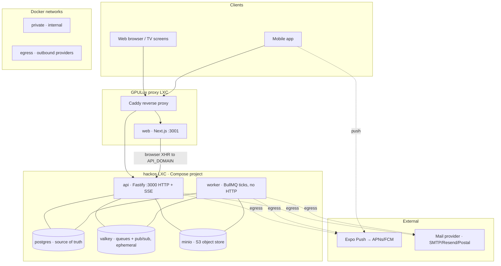
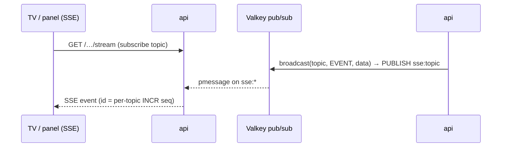

# Architecture & infrastructure

How hackOS is put together as a running system: the services, the stacks they're
built on, how they connect, why the boundaries are drawn where they are, and how
it scales. This is the *system* view; for the operational runbook (GPULux,
secrets and deploy order) see [`deploy/README.md`](../deploy/README.md), and
for per-container env vars see [`env-vars.md`](./env-vars.md).

> **One image, one tenant.** The whole backend is a single Docker image
> (`apps/api/Dockerfile`) run in three modes, and one deployed instance serves
> exactly one hackathon. Everything below is per-instance and fully isolated.

---

## 1. The big picture

hackOS is a monorepo (pnpm workspaces) that replaces four legacy hackathon tools
with one platform:

| Path | What | Stack |
|---|---|---|
| `apps/api` | HTTP API + background workers | Fastify 5, BullMQ, `pg` (raw SQL), Better Auth |
| `apps/web` | Operator/participant web app + venue TV screens | Next.js 16 (standalone output) |
| `apps/mobile` | Participant & operator phone app | Expo Router (EAS builds, native APNs/FCM) |
| `packages/shared` | Cross-cutting `capabilities.ts` + `events.ts` | TypeScript, consumed by all |

At runtime that becomes several long-running containers plus one-shot init and
migration containers, alongside external push/mail providers:



The proxy is a separate GPULux LXC. Inside `hackos`, the `private` network
contains the datastores and app tier, while `egress` is joined only by
processes that call external providers. API and web publish only their HTTP
ports; Docker's Remote API is not exposed.

---

## 2. Service inventory

The canonical `deploy/docker-compose.yml` is one Compose project. The deploy
script updates API, worker and web together after the datastores and migration
gate are ready.

### api — the HTTP surface
- **Stack:** Fastify 5, `fastify-type-provider-zod` (schemas *are* the OpenAPI
  docs, served at `/documentation`), Better Auth for identity, `pg` for raw
  parameterized SQL (no ORM), `ioredis` for Valkey.
- **Image/command:** the shared image; `node dist/migrate.js && exec node
  dist/server.js` is the safe default, and the server entrypoint repeats the
  migration check for direct launches. Compose also retains a separate
  one-shot migration service.
- **Networks:** `private` **and** `egress` — the only service on both, because
  it talks to datastores and external providers.
- **Public:** yes, via the GPULux proxy forwarding `${API_DOMAIN}` to the
  published `API_PUBLISH_PORT`.
  Sets HSTS / nosniff / `X-Frame-Options: DENY` / referrer policy, trusts
  `X-Forwarded-*` (`TRUST_PROXY=true`) so the audit trail logs real client IPs.
- **State:** none. Fully horizontally scalable (§7).
- **Health:** `/healthz` is dependency-free process liveness. The Compose
  healthcheck gates the container; `/readyz` remains available to the proxy.
  PostgreSQL failure returns 503, while an ephemeral
  Valkey outage returns 200 with `status: degraded` so durable reads remain
  available and the process is not restarted or removed from ingress.
- **Bundled one-shot:** `migrate` (`node dist/migrate.js`) runs first, guarded by
  a Postgres advisory lock so concurrent redeploys/replicas can't race schema.

### worker — background processing
- **Stack:** same image, `node dist/worker.js`. No HTTP listener at all.
- **Networks:** `private` and `egress`. It needs internet egress (Expo push,
  mail, APNs) but no ingress, so it stays off the published HTTP ports.
  External DNS is pinned (§3, §8) so it never depends on the host's transient
  `resolv.conf`.
- **What it does:** repeatable BullMQ ticks drain DB-backed tables, while
  event-driven jobs carry explicit payloads for request-started work such as
  account-removal cleanup, meal scans, wallet sync and queue invalidations —
  see [`background-workers.md`](./background-workers.md). Domain state remains
  authoritative in Postgres; the event-driven jobs own their own idempotency
  and retry policy, while BullMQ provides the dispatch and repeatable timing.
- **Health:** disabled (serves no HTTP); liveness is process-based via
  `restart: unless-stopped`.
- **Scale:** replicas are safe — the outbox claim uses `FOR UPDATE SKIP LOCKED`,
  so no row is ever processed twice.

### web — frontend + TV screens
- **Stack:** Next.js 16, standalone output, `apps/web/Dockerfile`.
- **Networks:** `egress` only. **The web tier never touches the datastores** — it
  talks to the API through its public endpoint like any other browser client, so it
  has no reason to be on the private network.
- **Public:** the GPULux proxy forwards `${WEB_DOMAIN}` to the published
  `WEB_PUBLISH_PORT`, never through the API. The running Next.js server serves

  `/runtime-config.js` from its environment-specific `API_DOMAIN`/`WEB_DOMAIN`,
  so staging and production can use the same image code with environment-
  specific runtime configuration.
- **CORS coupling:** `https://${WEB_DOMAIN}` must be in the API's
  `CORS_ORIGINS` or the browser's credentialed calls are refused.

### postgres — source of truth
- **Stack:** `postgres:17-alpine`, `--data-checksums`. Raw SQL migrations only
  (`apps/api/db/migrations/NNNN_name.sql`, numbered in per-workstream bands).
- **Networks:** `private` only, **no host ports**. Reachable at `postgres:5432`
  and nowhere else. Password-protected.
- **State:** the `pgdata` volume — one of only two stateful pieces. Back this up.

### valkey — queues and realtime (ephemeral)
- **Stack:** `valkey/valkey:8-alpine` (Redis-compatible), `requirepass`,
  **persistence off** (`--save "" --appendonly no`).
- **Role:** three jobs, all ephemeral — (1) BullMQ queue backend for the worker
  ticks; (2) the SSE fan-out bus (§5); (3) the per-topic sequence counters.
  Losing Valkey loses only in-flight/transient state; the source of truth is
  always Postgres, so it recovers by re-ticking and clients refetching.
- **Networks:** `private` only, no host ports, reachable at `valkey:6379`.

### minio — object storage
- **Stack:** MinIO (S3-compatible) + a one-shot `mc` sidecar that creates the
  bucket idempotently and sets prefix policy: **`enterprises/` is anonymously
  readable** (sponsor logos, H44), **`uploads/` is private** (application files,
  H12, served only through the API's owner-or-staff proxied-download route).
- **Networks:** `private` only, no host ports, `minio:9000`. Console off by
  default (`MINIO_BROWSER=off`).
- **Public read path:** the browser loads sponsor logos directly from
  `S3_PUBLIC_URL` — a **Cloudflare-fronted hostname that proxies to the
  `enterprises/` prefix**. This is the single narrow public read into object
  storage; the admin API and the private `uploads/` prefix are never exposed
  (see §3). Without `S3_PUBLIC_URL` set, logo URLs fall back to the internal
  `http://minio:9000` host the browser can't reach, so they silently fail to
  load even though the upload succeeded.
- **State:** the `miniodata` volume — the second stateful piece. Swappable for a
  managed S3/R2 by repointing `S3_ENDPOINT` + `S3_PUBLIC_URL` (§7).

### mailpit — dev only
- Local `pnpm infra:up` catches all outbound mail at `localhost:8025`. Not part
  of any production deploy; production uses SMTP/Resend/Postal via
  `MAIL_PROVIDER`.

---

## 3. Networks: two boundaries, one security model

There are exactly two networks, and the split is the entire perimeter:

| | **private** (internal Docker network) | **egress** (Compose bridge) |
|---|---|---|
| Purpose | Databases, cache, object storage and app traffic | Outbound provider access plus web publishing |
| Host ports | **none** | API and web HTTP ports only |
| Members | api, worker, migrate, postgres, valkey, minio | api, worker, web |
| Reachability | by service name, internal only | LXC network for published app ports |

**Why two.** Datastores publish no host ports and live only on `private`, so
they are unreachable from the LXC network or the internet — only named services
on that network can talk to them. API and worker join `egress` for provider
calls; only API and web publish HTTP ports.

**The one exception — MinIO's public prefix.** MinIO is on `private` and its
admin API / S3 port are *not* exposed, but the `enterprises/` prefix carries an
anonymous-download policy (§4) and is served to browsers as public logos. That
read path is exposed through a **Cloudflare-fronted hostname** set as
`S3_PUBLIC_URL`, which proxies to MinIO's `enterprises/` prefix only — no host
port, no admin access, and the private `uploads/` prefix stays unreachable. So
the accurate statement is: MinIO has exactly one narrow public *read* path (its
public prefix), and nothing else about the datastores is reachable from outside.

**Egress.** The `private` network is `internal: true`, so datastores cannot use
the internet. API and worker reach mail and Expo push through the separate
`egress` bridge.

> **DNS gotcha (learned the hard way, H51).** Docker's embedded resolver
> (`127.0.0.11`) snapshots the *host's* upstream DNS servers at
> container-create time. If the host `resolv.conf` is transiently wrong during a
> deploy or reboot, the container bakes in
> dead upstreams: internal names still resolve, but every *external* lookup
> times out and outbound `fetch` dies with an opaque `fetch failed` — silently
> dropping push delivery while credentials are perfectly fine. The fix, now in
> the compose files, is `dns: ["1.1.1.1", "8.8.8.8"]` on api and worker, making
> external resolution deterministic and independent of host state.

**Names are the contract.** `DATABASE_URL`, `VALKEY_URL`, and `S3_ENDPOINT` hard-code
`postgres:5432` / `valkey:6379` / `minio:9000`. Nothing hard-codes `localhost`;
everything configurable comes from `src/config.ts` (zod-validated env).

---

## 4. State & data ownership

The single most important architectural rule: **Postgres is the only source of
truth; everything else is derivable or ephemeral.**

| Store | Owns | Durable? | If it's lost |
|---|---|---|---|
| **Postgres** | All domain state, the notification outbox (the *real* queue), audit log, sessions | Yes — back it up | Total loss; restore from snapshot |
| **Valkey** | BullMQ scheduling, SSE pub/sub + per-topic sequence counters | No (by design) | Transient; ticks re-run, clients refetch |
| **MinIO** | Uploaded files + public logos | Yes — back it up | Files gone; DB rows dangle until re-upload |

This is why the worker subsystem doesn't use BullMQ's own retry/DLQ: durability
would then live in Valkey, which is deliberately ephemeral. Instead, "queued"
work is rows in `notification_outbox` with `status` / `attempts` /
`next_attempt_at` / `last_error`, and BullMQ is only the clock that triggers a
drain. See [`background-workers.md`](./background-workers.md) for the full model
(retry, backoff, the `status='failed'` dead-letter set).

---

## 5. Realtime: SSE fanned out through Valkey

Venue TVs and operator panels hold long-lived SSE connections. Because the API
scales horizontally, a change written on one instance must reach subscribers
connected to *any* instance:



`broadcast()` (`src/lib/sse.ts`) `PUBLISH`es to `sse:<topic>`; every instance
`PSUBSCRIBE`s `sse:*` and relays to its *local* connections. Envelope ids are
monotonic per-topic Valkey `INCR` counters, so a client can detect gaps after a
reconnect and refetch full state (the recovery contract). CRUD writes emit a
payload-free `domain.changed` event only on their owning topic (`applications`,
`projects`, `identity`, `sponsors`, `logistics`, or `audit`). Operational queue,
TV, content, export, and per-user events keep their narrower contracts. There
is no global refresh stream and no read-cache invalidation hook: reads come
from Postgres, while SSE is only a scoped freshness signal. **The API tier is
therefore stateless** — any instance can serve any SSE client.

**Backpressure and connection budgets (H540).** A write to a slow client's
socket can report its kernel buffer is full (`write() === false`); rather than
buffer unboundedly, `sse.ts` waits up to `SSE_WRITE_TIMEOUT_MS` for the
socket to drain, then disconnects — the client's own auto-reconnect + refetch
is the recovery path, so a bounded queue would only delay the same outcome.
`subscribe()` also enforces global/per-topic/per-client connection budgets
(`SSE_MAX_CONNECTIONS_*`), rejecting with `429` before the response is
hijacked. All of it is scraped at `/metrics` (`hackos_sse_local_connections`,
`hackos_sse_disconnects_total`, `hackos_sse_rejections_total`). See
`docs/env-vars.md`.

**Event-day priority lanes (#544).** Non-streaming HTTP requests pass through
an in-process admission scheduler derived from the existing per-process
`DB_POOL_MAX` value; it does not resize or reconfigure the #540 pool. The
request user's highest-position assigned role is the primary priority: a
higher `roles.position` is admitted before a lower one, while anonymous
requests are below every assigned role. P0 is queue operators, judges and
accreditation/presence staff; P1 is sponsor/judge collaboration; P2 is public
TV/content; P3 is participant and other best-effort traffic. The lane remains
the tie-breaker for requests at the same role priority. Reserved capacity keeps
role-less P2/P3 traffic from consuming the operational share, while
role-bearing requests participate in the role ordering. The bounded
best-effort wait queue may shed P2/P3 with `429`.
The complete route/topic classification, capacity formula, role examples, and
edge cases live in [`request-admission.md`](./request-admission.md).
Long-lived SSE requests bypass this scheduler so they continue to be governed
only by #540's connection budgets and write backpressure. Monitor
`hackos_http_requests_total`,
`hackos_http_request_admission_wait_seconds`, and
`hackos_http_request_admission_queue_size` by lane, plus
`hackos_sse_local_connections` by lane and normalized topic family.

Participant queue invalidations are one delayed BullMQ job per current queue
group, coalescing all affected challenge transitions in that shared queue;
topology writes snapshot old and new groups and the worker re-resolves current
membership when a queued group id has gone stale. Called and pre-call
notifications remain immediate. Their scheduling and fan-out outcomes are exposed as
`hackos_queue_participant_invalidations_total{outcome="queued|coalesced|dropped|degraded"}`.
For browser-only refetch storms the optional
`POST /api/telemetry/refetch-storm` contract accepts only bounded enum fields
(`surface`, `topic`, `trigger` — `sse`, `visibility`, `poll`, `retry`, or
`manual`) plus `refetches` (1–1000) and
`windowSeconds` (1–300). It never accepts identities, URLs, user agents or free text, keeping
`hackos_browser_refetch_storms_total` and related metrics low-cardinality.

Mobile push is a different path entirely: the outbox dispatcher (worker) sends
to Expo, which routes to APNs/FCM — see the notifications module and
[`mobile.md`](./mobile.md).

---

## 6. The one image, three run modes

Everything backend ships as one artifact (`apps/api/Dockerfile`,
`node:22-alpine`, non-root `node` user under `tini` for signal handling):

```
node dist/migrate.js && exec node dist/server.js
                        → api      (HTTP + SSE)     default CMD, /healthz
node dist/worker.js     → worker   (BullMQ ticks)   no HTTP
node dist/migrate.js    → migrate  (one-shot)       advisory-locked, exits 0
```

**Why one image, not three.** The api and worker share all domain code —
importing `modules/index.js` is what registers both routes and worker
processors. Shipping one image means one build, one version to pin
(`IMAGE_TAG`), and zero drift between the code that enqueues and the code that
drains. In dev the worker runs *inline* in the API process
(`WORKERS_INLINE`/`config.workersInline`); in production it's a separate
container so heavy jobs never touch request latency.

---

## 7. Scalability

hackathon-scale load is bursty (registration opens, judging starts, meals) but
not large. The design leans on that: scale the stateless tier, keep one
Postgres.

**api — scale freely.** Stateless; add replicas behind the GPULux proxy. SSE works across
replicas via Valkey (§5), and `/readyz` gating keeps initializing replicas out
of rotation. The only shared state is Postgres/Valkey, both reached by name.

**worker — scale by replica count.** The outbox claim is
`FOR UPDATE SKIP LOCKED`, so N workers split the load with no double-send.
The queue pump discovers active rooms outside a transaction, then each
`callNextForRoom` runs as its own `withTransaction` with the transition locks;
pre-call discovery is likewise outside a transaction and `claimPreCall`
reacquires the queue-group lock and atomically claims one repo cycle. This
per-transition boundary preserves the "exactly one winner" invariant while
allowing replicas to process independent rooms. More replicas = more
throughput on notification dispatch and queue processing, safely. (Tick cadence,
not replica count, bounds latency for the periodic drains — tune `every: N` if a
5 s notification lag is too much before adding replicas.)

**Postgres is the real ceiling.** It's a single primary — the deliberate
bottleneck that keeps correctness simple. Pool size and timeouts are
env-configurable per process (`DB_POOL_MAX`, `DB_*_TIMEOUT_MS`; H540 — see
`docs/env-vars.md`), and every replica of api/worker holds its own pool, so
the budget to respect before scaling replicas is:

```
(api replicas × DB_POOL_MAX) + (worker replicas × DB_POOL_MAX) < Postgres max_connections
```

with headroom left for `migrate`'s one-shot connections and admin/superuser
use (Postgres defaults `max_connections` to 100). `/metrics` exposes pool
saturation (`hackos_db_pool_total/idle/waiting`), acquire-wait latency
(`hackos_db_pool_wait_seconds`), and aborted queries
(`hackos_db_query_timeouts_total`) to watch before that budget is exceeded.
The admission scheduler is intentionally a separate guardrail: its wait and
lane counters show whether P3 refetch bursts are being delayed or shed before
they can occupy all request-start slots, while the unchanged pool metrics show
actual database pressure.
Headroom, in order of reach-for:
1. Bigger box / more memory (the partial indexes keep the hot claim query cheap).
2. A connection pooler (PgBouncer) once api+worker replica count pushes the
   connection count up — see `docs/big-event-readiness.md` for sizing this
   for a specific event.
3. Read replicas once the operational read models need them; the SSE-driven
   refresh signals still keep those reads targeted, but do not pretend to be a
   correctness cache.
4. Partition/prune `notification_outbox` (and audit) for a very large event.

**Valkey / MinIO.** Valkey is single-node and ephemeral — a hackathon never
needs a cluster; if it dies, restart and ticks resume. MinIO is single-node;
swap it for managed S3/R2/Spaces by repointing `S3_ENDPOINT` + `S3_PUBLIC_URL`
when object durability/scale matters more than self-hosting.

**Multi-event = multi-instance, not multi-node.** A second hackathon is a second
fully-isolated Compose project with its own project name, volumes, networks, and
secret file. The GPULux proxy must route each public domain to the corresponding
published ports. This is the horizontal story for *tenancy*; it needs no
orchestration change.

**One thing to preserve if you ever change the topology.** The worker is a
*tick drainer*, not a per-job queue consumer, so its safety comes entirely from
`FOR UPDATE SKIP LOCKED` — any replica count is safe, but naive autoscaling on
CPU is a poor signal (a tick that finds an empty queue costs almost nothing).
Scale it on outbox depth
(`count(*) where status='queued' and next_attempt_at<=now()`) or just run a
small fixed replica count. And keep exactly one Postgres primary — don't "scale"
it with naive writable replicas.

---

## 8. Key decisions & their reasoning

| Decision | Why |
|---|---|
| **Raw SQL, no ORM** | Full control over the concurrency primitives the domain needs (`FOR UPDATE`, `SKIP LOCKED`, advisory locks); the "exactly one winner per transition" invariant is explicit, not hidden behind an ORM. |
| **Postgres-owned state, BullMQ for dispatch** | Keeps domain state authoritative while allowing explicit event-driven jobs alongside repeatable drains; Valkey remains disposable, and each processor documents how it retries or recovers after a broker loss. |
| **No server global read cache; scoped SSE refresh** (H41-H55, #533, #720) | Postgres remains authoritative and domain topics wake only related screens. The browser may deduplicate one identity-scoped resource at a time, but drops it on identity changes and invalidates exact keys after writes or matching SSE signals; public mirrors remain payload-free. |
| **Permissions by capability, never role** (H8) | Routes guard on `requireCapability(CAPABILITIES.X)`; the mobile app derives its tabs the same way, so a permission change applies without a reinstall (H55). |
| **One image, three commands** | One build, one version, zero enqueue/drain drift. |
| **Datastores off all public networks** | The perimeter is a network boundary, not per-service firewalls — nothing routes to `postgres`/`valkey`/`minio` from outside. |
| **Mail provider via env, not DB** (DELTA H52) | Switching SMTP/Resend/Postal is an ops action (redeploy), validated at boot by zod — no runtime toggle to get wrong. |
| **Wallet creds optional but never half-set** (H28) | Zod `superRefine` fails boot on a partially-configured platform; an unconfigured one returns a clean `503`, so a typo can't ship an invalid pass. |
| **Deterministic container DNS** (H51) | `dns:` pinned so external resolution never depends on the host's transient `resolv.conf` — the root cause of a real push outage. |
| **Web talks to API over the public URL** | The frontend is just another client; keeping it off the private network shrinks the trusted surface and lets it deploy/scale on its own domain. |

---

## 9. Deployment profile

GPULux runs the canonical Compose project inside an Incus LXC named `hackos`.
The public proxy is a separate Caddy LXC managed by `gpul-org/infra`; its
configuration routes the API and web domains to the two published HTTP ports.
The deployment workflow never reaches Docker remotely: a self-hosted runner on
GPULux uses the local Incus client to push files and execute the rollout inside
the target LXC.

Production and staging are separate Compose projects (`hackos-production` and
`hackos-staging`) and must have separate env files, domains, ports and stateful
volumes if they run at the same time. The workflow's GitHub Actions Environment
approval is separate from the LXC secret file. The `setup-gh-runner` block in
`gpul-org/infra` is currently commented out, so registering that runner is a
prerequisite rather than an assumption in the workflow.

---

## 10. Security posture (summary)

Full detail in [`deploy/README.md`](../deploy/README.md#operations-and-security); the
load-bearing points:

- **The api is the only public route into the datastores**; web is public but
  store-less; postgres and valkey have no public route at all. MinIO's sole
  public surface is the anonymous-read `enterprises/` prefix, served via a
  Cloudflare-fronted `S3_PUBLIC_URL` — its admin API and private `uploads/`
  prefix are never exposed.
- **Containers run unprivileged** (`USER node`, `no-new-privileges:true`) under
  `tini`.
- **CORS locked** to `CORS_ORIGINS` in production; credentialed cross-origin
  calls from anywhere else are refused.
- **Secrets live only in the LXC env file** (`/root/hackos/.env`), never in the
  image or repo; each environment gets its own, so a leak is contained to one
  event.
- **Audit trail** records real client IPs via `TRUST_PROXY` behind the proxy
  (H53); sensitive mutations are audited in the same transaction as the write.

---

*Keep this file true.* If you add a service, move a network boundary, change
what a datastore owns, or alter the scaling story, update this doc in the same
change — the same rule the rest of `docs/` follows.
