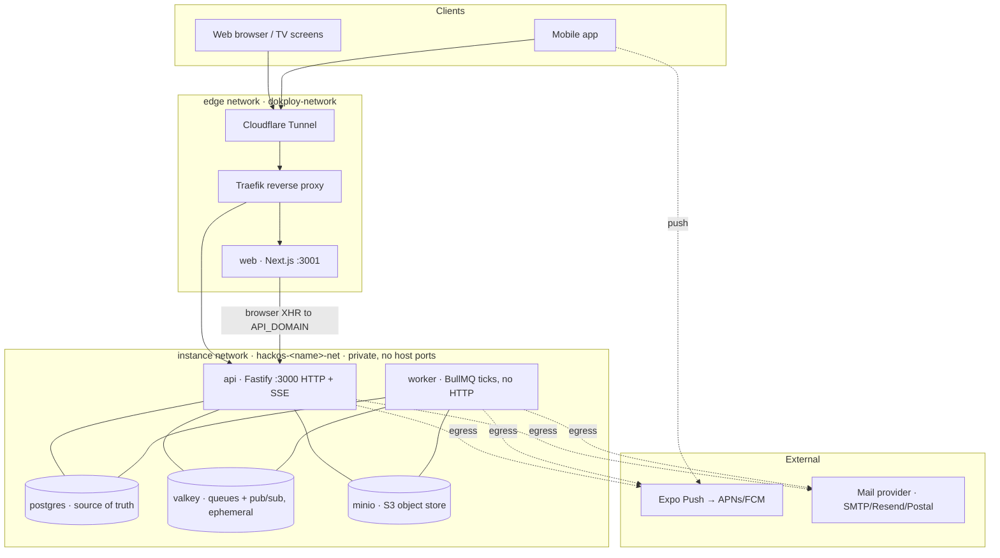
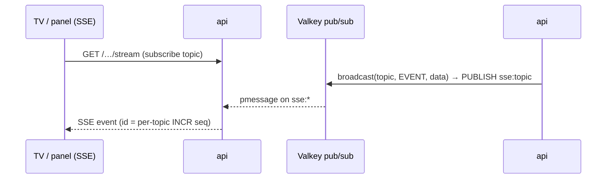

# Architecture & infrastructure

How hackOS is put together as a running system: the services, the stacks they're
built on, how they connect, why the boundaries are drawn where they are, and how
it scales. This is the *system* view; for the operational runbook (Dokploy
modes, secrets, deploy order) see [`deploy/README.md`](../deploy/README.md), and
for per-container env vars see [`env-vars.md`](./env-vars.md).

> **One image, one tenant.** The whole backend is a single Docker image
> (`apps/api/Dockerfile`) run in three modes, and one deployed instance serves
> exactly one hackathon. Everything below is per-instance and fully isolated.

---

## 1. The big picture

hackOS is a monorepo (pnpm workspaces) that replaces four legacy hackathon tools
with one platform:

| Path | What | Stack |
|---|---|---|
| `apps/api` | HTTP API + background workers | Fastify 5, BullMQ, `pg` (raw SQL), Better Auth |
| `apps/web` | Operator/participant web app + venue TV screens | Next.js 16 (standalone output) |
| `apps/mobile` | Participant & operator phone app | Expo Router (EAS builds, native APNs/FCM) |
| `packages/shared` | Cross-cutting `capabilities.ts` + `events.ts` | TypeScript, consumed by all |

At runtime that becomes **six containers** plus external push/mail providers:



The two boxes are the two Docker networks; the boundary between them is the
whole security model (§3).

---

## 2. Service inventory

Each service is its own Dokploy "Compose" service (Mode A) so it deploys, rolls
back, scales, and logs independently. `deploy/services/<svc>/docker-compose.yml`
is the source of truth for each.

### api — the HTTP surface
- **Stack:** Fastify 5, `fastify-type-provider-zod` (schemas *are* the OpenAPI
  docs, served at `/documentation`), Better Auth for identity, `pg` for raw
  parameterized SQL (no ORM), `ioredis` for Valkey.
- **Image/command:** the shared image, `node dist/server.js`.
- **Networks:** `instance` **and** `edge` — the only service on both, because
  it's the only one that is both publicly reachable *and* talks to datastores.
- **Public:** yes, via Traefik router `${STACK_NAME}-api` on `${API_DOMAIN}`.
  Sets HSTS / nosniff / `X-Frame-Options: DENY` / referrer policy, trusts
  `X-Forwarded-*` (`TRUST_PROXY=true`) so the audit trail logs real client IPs.
- **State:** none. Fully horizontally scalable (§7).
- **Health:** `/healthz` pings Postgres + Valkey; Traefik gates traffic on it.
- **Bundled one-shot:** `migrate` (`node dist/migrate.js`) runs first, guarded by
  a Postgres advisory lock so concurrent redeploys/replicas can't race schema.

### worker — background processing
- **Stack:** same image, `node dist/worker.js`. No HTTP listener at all.
- **Networks:** `instance` only. It needs internet egress (Expo push, mail,
  APNs) but no ingress, so it stays off the proxy network. Egress rides the
  instance bridge's NAT; external DNS is pinned (§3, §8) so it never depends on
  the host's transient `resolv.conf`.
- **What it does:** repeatable BullMQ "tick" jobs that drain DB-backed queues —
  see [`background-workers.md`](./background-workers.md). Durability, retry,
  backoff and dead-letter all live in Postgres rows; BullMQ is just the
  heartbeat.
- **Health:** disabled (serves no HTTP); liveness is process-based via
  `restart: unless-stopped`.
- **Scale:** replicas are safe — the outbox claim uses `FOR UPDATE SKIP LOCKED`,
  so no row is ever processed twice.

### web — frontend + TV screens
- **Stack:** Next.js 16, standalone output, `apps/web/Dockerfile`.
- **Networks:** `edge` only. **The web tier never touches the datastores** — it
  talks to the API over the public internet like any other browser client, so it
  has no reason to be on the private network.
- **Public:** its **own** Traefik router `${STACK_NAME}-web` on `${WEB_DOMAIN}`,
  never served behind the API. `NEXT_PUBLIC_API_URL` is baked in at build time,
  so each domain builds its own image.
- **CORS coupling:** `https://${WEB_DOMAIN}` must be in the API's
  `CORS_ORIGINS` or the browser's credentialed calls are refused.

### postgres — source of truth
- **Stack:** `postgres:17-alpine`, `--data-checksums`. Raw SQL migrations only
  (`apps/api/db/migrations/NNNN_name.sql`, numbered in per-workstream bands).
- **Networks:** `instance` only, **no host ports**. Reachable at `postgres:5432`
  and nowhere else. Password-protected.
- **State:** the `pgdata` volume — one of only two stateful pieces. Back this up.

### valkey — queues, realtime, cache (ephemeral)
- **Stack:** `valkey/valkey:8-alpine` (Redis-compatible), `requirepass`,
  **persistence off** (`--save "" --appendonly no`).
- **Role:** three jobs, all ephemeral — (1) BullMQ queue backend for the worker
  ticks; (2) the SSE fan-out bus (§5); (3) the sequence counters + read-cache
  invalidation channel. Losing Valkey loses only in-flight/transient state; the
  source of truth is always Postgres, so it recovers by re-ticking.
- **Networks:** `instance` only, no host ports, reachable at `valkey:6379`.

### minio — object storage
- **Stack:** MinIO (S3-compatible) + a one-shot `mc` sidecar that creates the
  bucket idempotently and sets prefix policy: **`enterprises/` is anonymously
  readable** (sponsor logos, H44), **`uploads/` is private** (application files,
  H12, served only through the API's owner-or-staff proxied-download route).
- **Networks:** `instance` only, no host ports, `minio:9000`. Console off by
  default (`MINIO_BROWSER=off`).
- **Public read path:** the browser loads sponsor logos directly from
  `S3_PUBLIC_URL` — a **Cloudflare-fronted hostname that proxies to the
  `enterprises/` prefix**. This is the single narrow public read into object
  storage; the admin API and the private `uploads/` prefix are never exposed
  (see §3). Without `S3_PUBLIC_URL` set, logo URLs fall back to the internal
  `http://minio:9000` host the browser can't reach, so they silently fail to
  load even though the upload succeeded.
- **State:** the `miniodata` volume — the second stateful piece. Swappable for a
  managed S3/R2 by repointing `S3_ENDPOINT` + `S3_PUBLIC_URL` (§7).

### mailpit — dev only
- Local `pnpm infra:up` catches all outbound mail at `localhost:8025`. Not part
  of any production deploy; production uses SMTP/Resend/Postal via
  `MAIL_PROVIDER`.

---

## 3. Networks: two boundaries, one security model

There are exactly two networks, and the split is the entire perimeter:

| | **instance** (`hackos-<name>-net`) | **edge** (`dokploy-network`) |
|---|---|---|
| Purpose | All inter-service + datastore traffic | Public ingress (Traefik / tunnel) |
| Host ports | **none** | Traefik's 443 only |
| Members | api, worker, postgres, valkey, minio | api, web, Traefik, Cloudflare Tunnel |
| Reachability | by service name, internal only | public via routers |

**Why two.** Datastores publish no host ports and live only on `instance`, so
they are unreachable from the host or the internet — only named services on the
same private network can talk to them. Only the api (both networks) and the web
(edge only) are ever public. This is why `postgres` and `valkey` need no
firewall of their own: there is simply no route to them from outside.

**The one exception — MinIO's public prefix.** MinIO is on `instance` and its
admin API / S3 port are *not* exposed, but the `enterprises/` prefix carries an
anonymous-download policy (§4) and is served to browsers as public logos. That
read path is exposed through a **Cloudflare-fronted hostname** set as
`S3_PUBLIC_URL`, which proxies to MinIO's `enterprises/` prefix only — no host
port, no admin access, and the private `uploads/` prefix stays unreachable. So
the accurate statement is: MinIO has exactly one narrow public *read* path (its
public prefix), and nothing else about the datastores is reachable from outside.

**Egress.** The `instance` network is a *normal* bridge (not `internal`), so api
and worker reach the internet for mail and Expo push through its NAT. Datastores
don't need egress and effectively don't use it.

> **DNS gotcha (learned the hard way, H51).** Docker's embedded resolver
> (`127.0.0.11`) snapshots the *host's* upstream DNS servers at
> container-create time. If the host `resolv.conf` is transiently wrong during a
> deploy (a reboot, or Tailscale/MagicDNS reconnecting), the container bakes in
> dead upstreams: internal names still resolve, but every *external* lookup
> times out and outbound `fetch` dies with an opaque `fetch failed` — silently
> dropping push delivery while credentials are perfectly fine. The fix, now in
> the compose files, is `dns: ["1.1.1.1", "8.8.8.8"]` on api and worker, making
> external resolution deterministic and independent of host state.

**Names are the contract.** `DATABASE_URL`, `VALKEY_URL`, and `S3_ENDPOINT` hard-code
`postgres:5432` / `valkey:6379` / `minio:9000`. Nothing hard-codes `localhost`;
everything configurable comes from `src/config.ts` (zod-validated env).

---

## 4. State & data ownership

The single most important architectural rule: **Postgres is the only source of
truth; everything else is derivable or ephemeral.**

| Store | Owns | Durable? | If it's lost |
|---|---|---|---|
| **Postgres** | All domain state, the notification outbox (the *real* queue), audit log, sessions | Yes — back it up | Total loss; restore from snapshot |
| **Valkey** | BullMQ scheduling, SSE pub/sub + seq counters, read-cache invalidation | No (by design) | Transient; ticks re-run, clients refetch |
| **MinIO** | Uploaded files + public logos | Yes — back it up | Files gone; DB rows dangle until re-upload |

This is why the worker subsystem doesn't use BullMQ's own retry/DLQ: durability
would then live in Valkey, which is deliberately ephemeral. Instead, "queued"
work is rows in `notification_outbox` with `status` / `attempts` /
`next_attempt_at` / `last_error`, and BullMQ is only the clock that triggers a
drain. See [`background-workers.md`](./background-workers.md) for the full model
(retry, backoff, the `status='failed'` dead-letter set).

---

## 5. Realtime: SSE fanned out through Valkey

Venue TVs and operator panels hold long-lived SSE connections. Because the API
scales horizontally, a change written on one instance must reach subscribers
connected to *any* instance:



`broadcast()` (`src/lib/sse.ts`) `PUBLISH`es to `sse:<topic>`; every instance
`PSUBSCRIBE`s `sse:*` and relays to its *local* connections. Envelope ids are
monotonic per-topic Valkey `INCR` counters, so a client can detect gaps after a
reconnect and refetch full state (the recovery contract). Worker-originated
changes have no HTTP response, so every domain event is also mirrored into a
global "data changed" stream that nudges clients to refetch. **The API tier is
therefore stateless** — any instance can serve any SSE client.

Mobile push is a different path entirely: the outbox dispatcher (worker) sends
to Expo, which routes to APNs/FCM — see the notifications module and
[`mobile.md`](./mobile.md).

---

## 6. The one image, three run modes

Everything backend ships as one artifact (`apps/api/Dockerfile`,
`node:22-alpine`, non-root `node` user under `tini` for signal handling):

```
node dist/server.js    → api      (HTTP + SSE)     default CMD, /healthz
node dist/worker.js     → worker   (BullMQ ticks)   no HTTP
node dist/migrate.js    → migrate  (one-shot)       advisory-locked, exits 0
```

**Why one image, not three.** The api and worker share all domain code —
importing `modules/index.js` is what registers both routes and worker
processors. Shipping one image means one build, one version to pin
(`IMAGE_TAG`), and zero drift between the code that enqueues and the code that
drains. In dev the worker runs *inline* in the API process
(`WORKERS_INLINE`/`config.workersInline`); in production it's a separate
container so heavy jobs never touch request latency.

---

## 7. Scalability

hackathon-scale load is bursty (registration opens, judging starts, meals) but
not large. The design leans on that: scale the stateless tier, keep one
Postgres.

**api — scale freely.** Stateless; add replicas behind Traefik. SSE works across
replicas via Valkey (§5), and `/healthz` gating keeps initializing replicas out
of rotation. The only shared state is Postgres/Valkey, both reached by name.

**worker — scale by replica count.** The outbox claim is
`FOR UPDATE SKIP LOCKED`, so N workers split the load with no double-send;
state-machine ticks (queue pump, expirer) mutate under `SELECT … FOR UPDATE`
with an "exactly one winner per transition" invariant. More replicas = more
throughput on notification dispatch and queue processing, safely. (Tick cadence,
not replica count, bounds latency for the periodic drains — tune `every: N` if a
5 s notification lag is too much before adding replicas.)

**Postgres is the real ceiling.** It's a single primary — the deliberate
bottleneck that keeps correctness simple. Headroom, in order of reach-for:
1. Bigger box / more memory (the partial indexes keep the hot claim query cheap).
2. A connection pooler (PgBouncer) once api+worker replica count pushes the
   connection count up.
3. Read replicas — but the app already absorbs read load with the SSE-driven
   read-cache, so this is rarely the first lever.
4. Partition/prune `notification_outbox` (and audit) for a very large event.

**Valkey / MinIO.** Valkey is single-node and ephemeral — a hackathon never
needs a cluster; if it dies, restart and ticks resume. MinIO is single-node;
swap it for managed S3/R2/Spaces by repointing `S3_ENDPOINT` + `S3_PUBLIC_URL`
when object durability/scale matters more than self-hosting.

**Multi-event = multi-instance, not multi-node.** A second hackathon is a second
fully-isolated stack (unique `STACK_NAME` + `INSTANCE_NETWORK` + Dokploy
project) — separate networks, volumes, secrets, and Traefik routers, zero shared
state. This is the horizontal story for *tenancy*; it needs no orchestration
change.

**One thing to preserve if you ever change the topology.** The worker is a
*tick drainer*, not a per-job queue consumer, so its safety comes entirely from
`FOR UPDATE SKIP LOCKED` — any replica count is safe, but naive autoscaling on
CPU is a poor signal (a tick that finds an empty queue costs almost nothing).
Scale it on outbox depth
(`count(*) where status='queued' and next_attempt_at<=now()`) or just run a
small fixed replica count. And keep exactly one Postgres primary — don't "scale"
it with naive writable replicas.

---

## 8. Key decisions & their reasoning

| Decision | Why |
|---|---|
| **Raw SQL, no ORM** | Full control over the concurrency primitives the domain needs (`FOR UPDATE`, `SKIP LOCKED`, advisory locks); the "exactly one winner per transition" invariant is explicit, not hidden behind an ORM. |
| **Durability in Postgres, BullMQ as a clock** | Keeps the single source of truth authoritative; Valkey stays disposable. Retryable work survives a Valkey wipe. |
| **Permissions by capability, never role** (H8) | Routes guard on `requireCapability(CAPABILITIES.X)`; the mobile app derives its tabs the same way, so a permission change applies without a reinstall (H55). |
| **One image, three commands** | One build, one version, zero enqueue/drain drift. |
| **Datastores off all public networks** | The perimeter is a network boundary, not per-service firewalls — nothing routes to `postgres`/`valkey`/`minio` from outside. |
| **Mail provider via env, not DB** (DELTA H52) | Switching SMTP/Resend/Postal is an ops action (redeploy), validated at boot by zod — no runtime toggle to get wrong. |
| **Wallet creds optional but never half-set** (H28) | Zod `superRefine` fails boot on a partially-configured platform; an unconfigured one returns a clean `503`, so a typo can't ship an invalid pass. |
| **Deterministic container DNS** (H51) | `dns:` pinned so external resolution never depends on the host's transient `resolv.conf` — the root cause of a real push outage. |
| **Web talks to API over the public URL** | The frontend is just another client; keeping it off the private network shrinks the trusted surface and lets it deploy/scale on its own domain. |

---

## 9. Deployment profiles

The same six compose files run in two very different settings. **Only the host
and the ingress path differ** — the services, networks, and env are identical,
which is the point of keeping ingress out of the app.

### Profile A — small / testing (self-hosted, behind CGNAT)

For development, demos, and low-stakes testing on whatever hardware is handy —
often a home server or a single Raspberry Pi, which is typically behind
**carrier-grade NAT** with no inbound port forwarding available:

- **Host:** a single small box (e.g. Raspberry Pi 5, arm64) running **Dokploy**.
- **Ingress:** a **Cloudflare Tunnel** (`cloudflared`) instead of open ports —
  it dials *out* to Cloudflare, so the box is reachable **despite CGNAT** with
  no port forwarding. The tunnel sits on the `edge` network and reaches the
  api/web containers by name (`http://api:3000`, `http://hackos-web:3001`);
  Traefik still handles internal routing.
- **Admin plane:** **Tailscale** (100.x MagicDNS) for SSH/ops, off the public
  path. (This is also the source of the §3 DNS gotcha: a MagicDNS reconnect
  mid-deploy is what poisoned the worker's resolver.)

### Profile B — real events (VPS / cloud, public IP)

Actual hackathons run on a proper provider — **Hetzner** or similar — with a
real public IP:

- **Host:** a cloud VPS/dedicated box running Dokploy (single or multi-node).
- **Ingress:** **Traefik directly on the public IP**, terminating TLS via ACME
  (`CERT_RESOLVER=letsencrypt`) on `${API_DOMAIN}` / `${WEB_DOMAIN}`. No tunnel
  needed — there's no CGNAT to punch through — though a Cloudflare Tunnel
  remains a valid choice if you'd rather not expose the origin IP.
- **Scale headroom:** a bigger instance handles the api/worker/Postgres load for
  a full event; the §7 levers (worker replicas, PgBouncer, managed
  S3/Postgres) apply here first.

**Why document both.** The architecture deliberately doesn't bake in an ingress
assumption: `cloudflared` vs. public Traefik is a host-level choice that never
touches the compose files. The CGNAT/tunnel path exists so testing works from a
home network; production drops it for a plain public route. Either way,
postgres/valkey/minio stay local containers on the private `instance` network —
back up `pgdata` + `miniodata` regardless of host.

---

## 10. Security posture (summary)

Full detail in [`deploy/README.md`](../deploy/README.md#security-posture); the
load-bearing points:

- **Only the api is publicly routable** to datastores; web is public but
  store-less; postgres and valkey have no public route at all. MinIO's sole
  public surface is the anonymous-read `enterprises/` prefix, served via a
  Cloudflare-fronted `S3_PUBLIC_URL` — its admin API and private `uploads/`
  prefix are never exposed.
- **Containers run unprivileged** (`USER node`, `no-new-privileges:true`) under
  `tini`.
- **CORS locked** to `CORS_ORIGINS` in production; credentialed cross-origin
  calls from anywhere else are refused.
- **Secrets live only in the env store** (Dokploy Environment / gitignored
  `.env.<instance>`), never in the image or repo; each instance gets its own, so
  a leak is contained to one event.
- **Audit trail** records real client IPs via `TRUST_PROXY` behind the proxy
  (H53); sensitive mutations are audited in the same transaction as the write.

---

*Keep this file true.* If you add a service, move a network boundary, change
what a datastore owns, or alter the scaling story, update this doc in the same
change — the same rule the rest of `docs/` follows.
